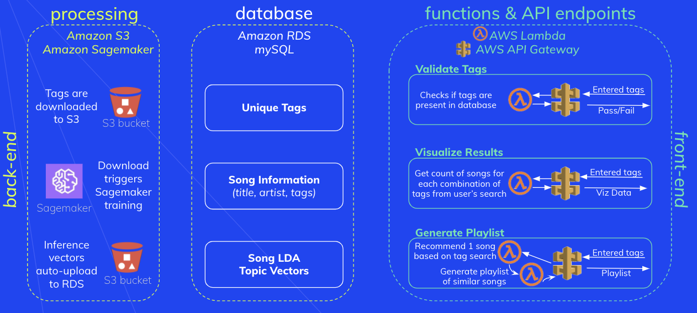

## Finding the Right Data

### Objective
As is true for all music recommendation engines, the core of lucyd is a database of songs with different attributes assigned to each song. Our attribute of interest is tags--words assigned to songs by listeners who are characterizing the song not just by the artist or genre, but in a way that is more personal and meaningful to their unique experience.

To feasibly complete an **end-to-end music recommendation platform** in 14 weeks, we needed:
  1. a starter dataset, and
  2. cloud infrastructure to support queries sent through a website.

### Approach
#### Starter Dataset
There are many open-source music databases, including APIs to popular streaming services. After researching 10 possible data sources, we found the most promising to be the [Million Song Dataset](http://millionsongdataset.com/) (MSD) and [last.fm](https://www.last.fm/api/).

Both sources provided easily accessible datasets which included tags at the song and/or artist level. Exploratory data analysis (detailed [here](./Notebooks/00_MSD_EDA.ipynb)) revealed that the tag data was a little sparse, but it would be more than enough to build a viable recommendation model.

The mission of lucyd is to provide recommendations based entirely on crowd-sourced information about songs. Our data is based on existing tag data from last.fm and the Million Song Dataset while providing users the ability to add to the existing corpus.

#### Data Transformations
The Million Song Dataset is publicly available via an Amazon EC2 instance. [This notebook](./Notebooks/01_Retrieve%20Raw%20MSD%20Data.ipynb) outlines the steps we took to retrieve fields and download them to an S3 bucket for use with lucyd.

Once we had a working copy of the Million Song Dataset, we [downloaded the last.fm data and merged the tag information](./Notebooks/02_Merge%20Last.FM%20Tags.ipynb) contained within with our primary dataset.

Finally, we needed to link each track to Spotify so that we would be able to provide audio clips and links for songs displayed within lucyd. Both MSD and last.fm provide unique song identifiers, however we found that many of these identifiers were out of date. We ran [this process](./Notebooks/03_MSDSongID_Spotify_Crosswalk.ipynb) to update the identifiers using an open-source crosswalk. For those songs not included in the crosswalk, we searched the song name and artist using Spotify's API and retrieved the song identifier.

#### Cloud Infrastructure
Simply requesting songs from user-inputted tags is not a complex task when performed in a local environment with a relatively small dataset. Executing this process at scale in a cloud environment is much more complex.

Executing a tag query in lucyd requires eight data exchanges. As seen in the diagram below, the user asks lucyd for information about a series of tags. Under the hood, lucyd then asks for information from a series of custom APIs from Amazon Web Services (AWS). These APIs activate Lambda functions (on-demand functions within our AWS infrastructure), which subsquently perform queries in the underlying lucyd database. The lucyd database relays that information back up to the Lambda function, which performs some tasks with it, sends it back to the API Gateway, which reports it back to the webpage. Whew! If you didn't follow that, I don't blame you. Here's a diagram to fill in the gaps in our eloquence.

For more detail on the full architecture of our deployed product, refer to the [Application Framework](../4_ApplicationFramework) section.
### References
#### Million Song Dataset
Thierry Bertin-Mahieux, Daniel P.W. Ellis, Brian Whitman, and Paul Lamere.
The Million Song Dataset. In Proceedings of the 12th International Society
for Music Information Retrieval Conference (ISMIR 2011), 2011.
#### last.fm
Last.fm dataset, the official song tags and song similarity collection for the Million Song
Dataset, available at: http://millionsongdataset.com/lastfm
