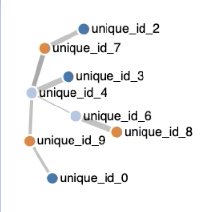
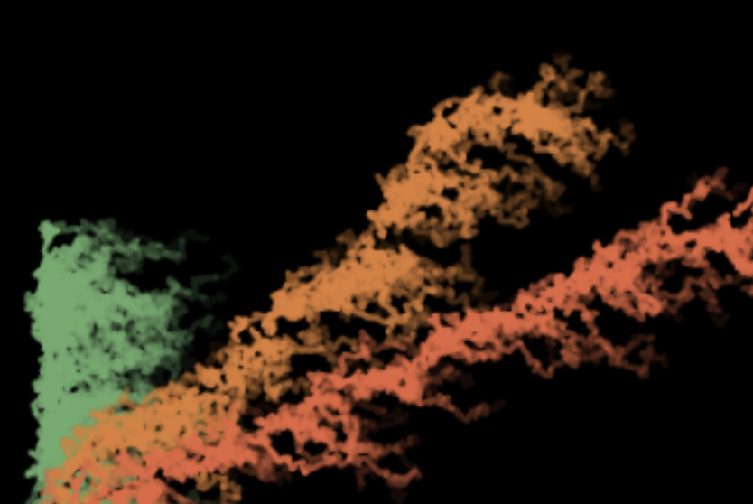
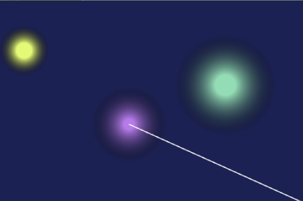
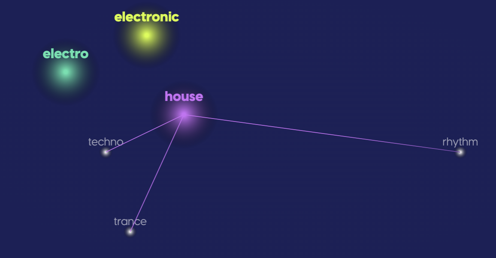
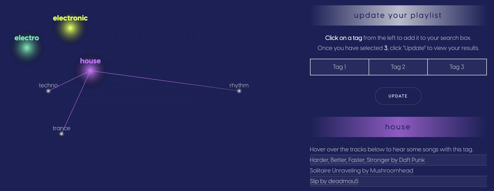

## Visualizing a Song Space and Nearby Tags

### Objective
The overarching goal of lucyd was to create a simple tool that taught the user where their music recommendations came from, and how they might modify those recommendations to best suit their mood. As is detailed in the [Algorithms](https://github.com/timspit/lucyd/tree/master/1_Algorithms) section, we used machine learning and natural language processing techniques to identify the recommended songs based on user tags. The next challenge was **how can we communicate the source of those recommendations to a user?**

We determined that this would require two steps:
  1. **Visualize a filtered song space:** Show the user the number of songs returned by their tag query, and a summary of the tags associated with those songs.
  2. **Visualize song clusters determined by tags:** Show the user tags that are similar to those used in the tag query, as determined by a cluster analysis in a multi-dimensional space.

### Approach
#### Visualize a Filtered Song Space
We chose to use a Venn Diagram to visualize the number of songs returned from a user's tag query and the amount of overlap between tags for that set of songs. A Venn Diagram is a classic infographic that we believed most users would be familiar with, and, with the help of some responsive tooltips, easily understand the space of songs returned by their query.

To implement the Venn Diagram, we used Ben Frederickson's [venn.js](https://github.com/benfred/venn.js) library. This library allowed us to take data sent through an API response and quickly render a proportional Venn Diagram that could support user interactions.
```javascript
// Initialize the Venn Diagram
var chart = venn.VennDiagram()
    .width(width)
    .height(height)
    ;
//...pull API response with song sets as var 'graph'...
// Bind the data to the Venn Diagram within the appropriate HTML element
var div = d3.select("#venn_box").datum(graph.data).call(chart);
```

Because the `venn.js` library uses [d3](https://d3js.org/), the resulting visualizations are highly customizeable. We sought to add three customizations to improve the users' experience with this element of lucyd:
  1. Change color scheme to align with lucyd brand colors.
```javascript
//List of lucyd brand colors
var colors = ['#D5FF31',
              '#CC6CF7',
              '#4FE3AE',
              '#E0007A'
            ];
// Update style of Venn circles and create a list to hold legend values
div.selectAll(".venn-circle path")
        .style("fill-opacity", 0.75)
        .style("fill", function(d, i) {
          color_ids.push([d.label, colors[i]]);
          return colors[i];
        })
        .style("color", function(d) {
          return d[1];
        });
```
  2. Add a legend to indicate which circle corresponds to which tag.
```javascript
// Select the legend element from the HTML template
var legend = d3.select("#venn_legend");
// Update the text of the legend with the tags and their corresponding colors
legend.selectAll("th")
      .data(color_ids.reverse())
      .enter()
      .append("th")
      .text(function(d){
        return d[0];
      })
      .style("color", function(d) {
        return d[1];
      });
```
  3. Add interactive tooltips indicating the number of songs within each set of tag(s).
```javascript
function handleMouseMove(d, i) {

  // sort all the areas relative to the current item
  venn.sortAreas(div, d);

  // highlight the current path
  var selection = d3.select(this).transition("tooltip");
  selection.select("path")
      .style("stroke-width", 3)
      .style("fill-opacity", d.sets.length == 1 ? .8 : 0)
      .style("stroke-opacity", 1);

  // Display a tooltip with the current size
  var t = d3.transition().duration(200).ease(d3.easeLinear);
  tooltip.transition(t)
          .style("visibility", "visible");
  tooltip.select(".tooltip-header")
          .text(numberWithCommas(d.size) + " songs");
  tooltip.select(".tooltip-body")
          .text(d.label);

  tooltip.style("left", (d3.event.pageX) + "px")
         .style("top", (d3.event.pageY - 28) + "px");
}
```

#### Visualize Song Clusters
In addition to showing users the set of songs returned by their search, we wanted to provide a tool to show them additional tags that might be similar to what they originally entered. This helped address the differences between how one user may perceive the tag "rock" compared to another. If the songs returned by a search were not really what the user wanted, we needed to provide a tool for them to move around the space of songs. This became the **"Explore"** feature.

We went through several iterations for this visualization, starting from a classic network graph and ending with something resembling several stars floating in space. The images below depict the progression for this design.

| Original Concept | Iteration 1 | Iteration 2 | Final Design |
----:|:-----------:|:-----------:|:-------------:
|||

The Final Design shows the tags from the user's original search (shown as the smaller, white stars), as well as 3 "adjacent tags", as determined by a cosine-similarity algorithm (explained in detail [here](/link/to/Mike's/page)). The distance between each point represents the distance (or similarity) between the tags in multi-dimensional space, reduced to 2 dimensions for the purposes of the visualization.

When we moved to Iteration 1, we started using HTML5 Canvas to draw the paths as opposed to D3.js. The Final Design certainly could have been rendered using D3, but at a certain stage we had reached a point of no return with Canvas. Given more time, I would have liked to switch this graphic to D3 because it would have allowed for more flexible transitions without having to clear the element. Most importantly, D3 would have allowed data elements to be attached to the clusters. The Final Design using Canvas runs a calculation to determine which cluster is nearest to the user's mouse and refers to an Object containing all of the cluster attributes to present an interactive legend. If the data elements were simply attached to each cluster in D3, the same level of interactivity could be achieved in a much more efficient manner.

##### Add On Features
To increase the value of **Explore** to the user, we added the following features:
  1. Include 3 song clips for each of the adjacent tags. This helps the user understand the types of songs they might get if they included one of these tags in a subsequent search.**
  2. Update search results using a combination of tags from **Explore**. This allows the user to "meander" through different playlists, using their original search as a starting point.

The image below shows the final design, with the added features.


***Note: we were originally planning to show the numeric distances between the tags, in an attempt to communicate the level of similarity between the tags. During testing, we realized that it did not matter what the number or distance was, it would not help describe songs with this tag to the user. Thus, we felt it was important to include the song clips.*

### What Would We Change?
The visualizations went through many iterations. The Venn Diagram was the first element completed, towards the beginning of the project, when I felt very new and uncomfortable with D3.js. When I re-visited the code behind that graphic at the end of the project, I saw many things that were a result of my lack of familiarity that could either be completely removed or greatly improved.

In the final week of our project, we moved all of our backend requests to AJAX so that the webpage need not reload every time the user wanted to update something (more detail on this shift [here](link/to/framework)). This greatly improved the sleekness of our product and the overall user experience, but it also meant that the visualizations needed to be flexible to changing data sources. The quick and dirty workaround to address this was to remove all the elements whenever the user entered a new search, but a far better approach would have been to make use of D3's [.enter(), .update() and .exit() objects](https://medium.com/@c_behrens/enter-update-exit-6cafc6014c36). Given more time, I would have 1) transitioned the cluster visualization the D3 and 2) implemented those methods to make the visualizations flexible to changing data without removing the underlying elements.
