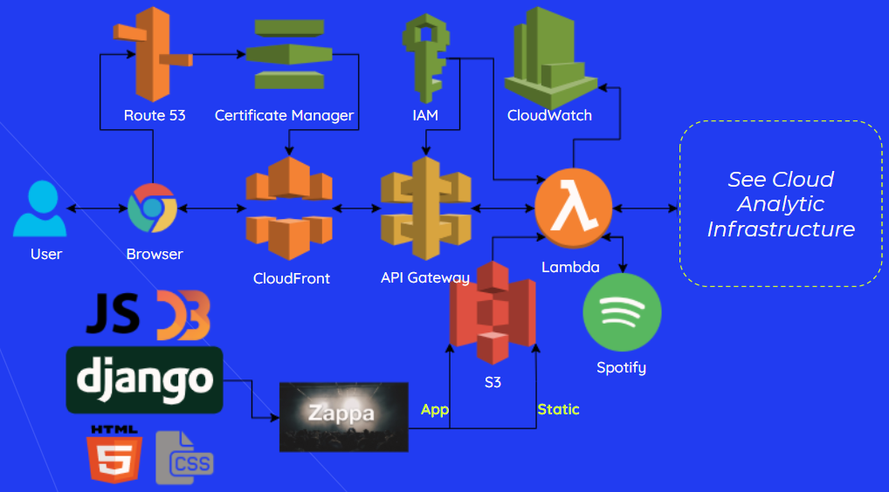

## Building a Web App

### Objective

Our objective was to connect our recommendation algorithms and dynamic visualizations into an interactive web application for users to explore and find new music. We built upon existing web frameworks to develop a custom application and deployed to a serverless architecture to maximize availability, ensure scalability,and minimize uptime costs.  

## Approach
Below is a flowchart outlining the various elements of our application framework.  

### Interactive Web App  
We built the initial app protoype using the **Django** web framework (leveraging our experience with **Python** to develop the backend). We customized the **HTML** (from [html5up.net](html5up.net)) to support desired flow between our user modules and further refined the **CSS** to present a consistent brand image (designed by [Mia Alcover](https://miaalcover.com/)). Most importantly, to create a seamless user experience, we implemented **AJAX** requests to allow **JavaScript** to asynchronously send queries to our algorithms, receive data, and update the **D3** elements of our webapp as the user engaged with various features.  

### Cloud Deployment
The lucyd app is deployed to **AWS API Gateway + AWS Lambda** via the **Zappa** package ([GitHub](https://github.com/Miserlou/Zappa)). This package zips the locally-developed Django application and saves in an **AWS S3** bucket to be served from an on-demand Lambda function server, reachable via API Gateway. Django provides admin functions to manage the static files which are stored in a separate dedicated S3 bucket. **AWS IAM** roles are also generated to manage permissions for execution of various functions. Logs are written to **AWS CloudWatch** to aid in development and troubleshooting.  

Our custom URL [lucyd.cool](lucyd.cool) was procured from the **AWS Route 53** registrar, which allowed for seamless setup of a hosted zone to store DNS records, HTTPS certificates from **AWS Certificate Manager** for secure connections, and **AWS CloudFront** distributions to "edge optimize" our application and increase availability across regions. 

We leveraged the Django framework to create internally served REST APIs to serve data needed for the various elements of our site. These APIs were used to call our machine learning playlist algorithm and data-generating algorithms to inform our visualizations. All of these analytic APIs follow a similar architecture as the web deployment (AWS Gateway -> AWS Lambda -> Data Source). For more information on the underlying cloud analytic instructure managing the calculation of our algorithms see the [Data Sources](../2_DataSources) section.  

